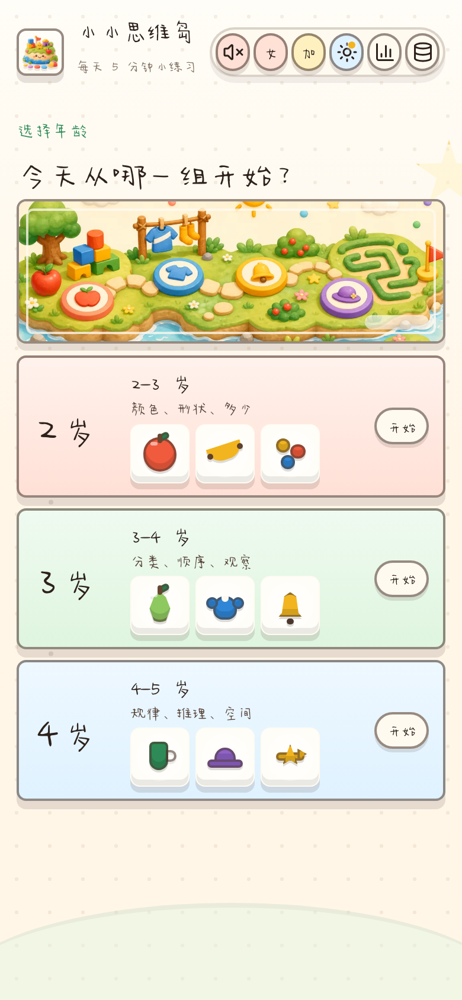
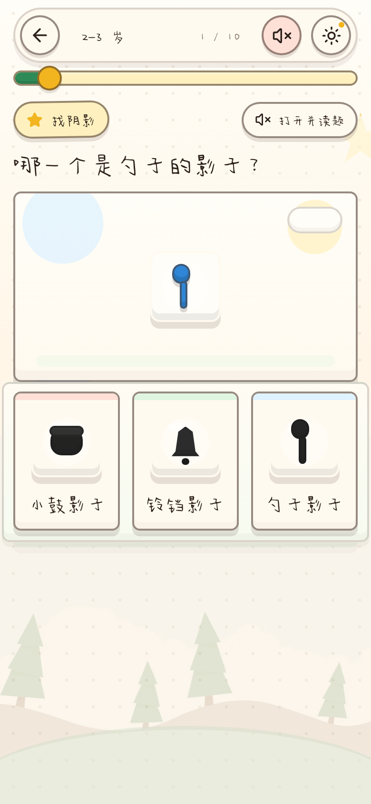
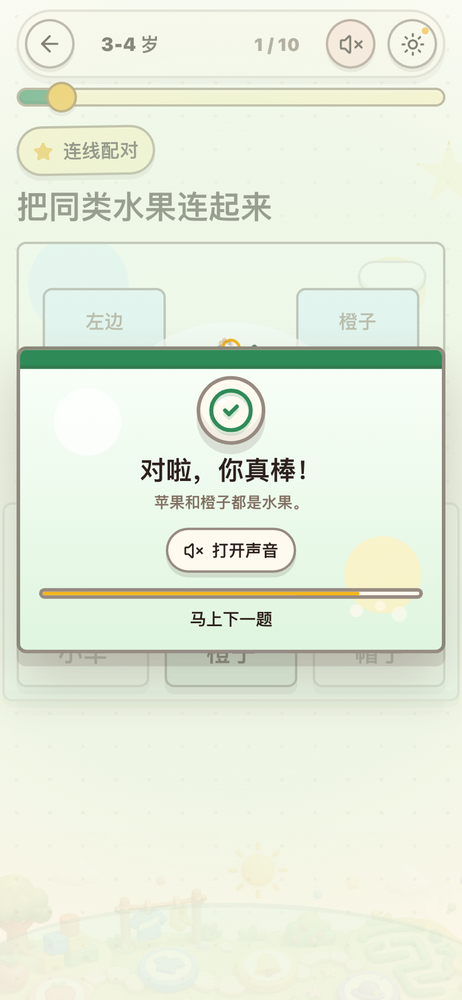
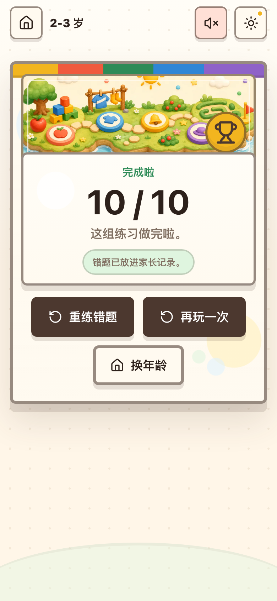
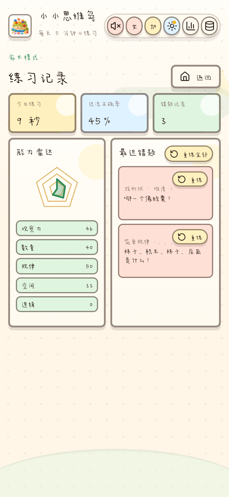
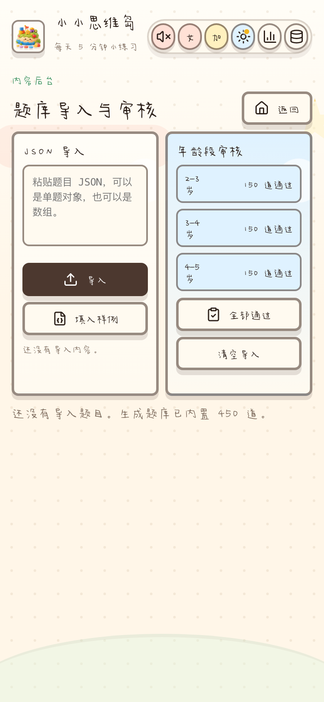
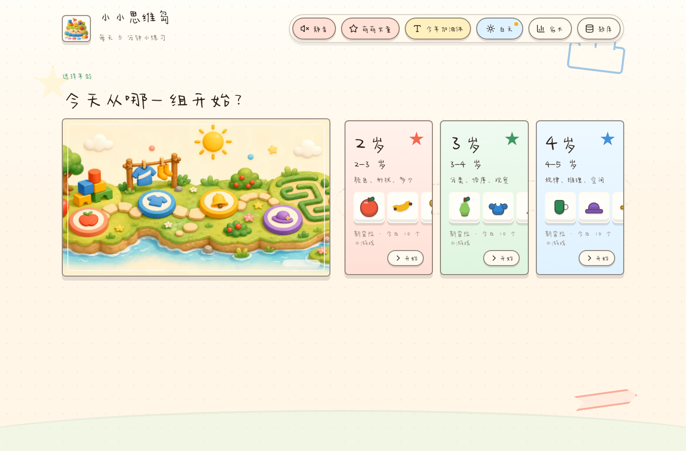

# 小小思维岛

小小思维岛是一个面向 2-5 岁儿童的益智答题 App 原型。它把纸质思维训练书常见的观察、分类、规律、空间和逻辑题，重新做成更适合孩子触摸操作的互动练习。

在线体验：[https://irvinezhao.github.io/kids-thinking-play/](https://irvinezhao.github.io/kids-thinking-play/)

## 项目亮点

- 移动端优先：进入后直接选择 2-3 岁、3-4 岁、4-5 岁，每组每日 10 题，适合碎片时间练习。
- 原创题库：当前内置 450 道精选校对题，每个年龄段 150 道，按能力标签、难度和题型组织。
- 多题型互动：支持普通选择、拖拽分类、连线配对、找阴影、路径迷宫、左右判断、矩阵补缺和数量合成。
- 连续去重：“玩更多”和“再玩一次”会优先避开同年龄段近期出现过的题目，让下一轮更有新鲜感。
- 低识字门槛：每道题进入后会自动朗读题干，优先播放本地人声音频或云端 TTS，缺失时再用系统中文朗读兜底。
- 双音色题干：题目朗读支持“萌萌女童”和“可爱男童”两种 MiniMax 音色，并可手动再读一次题目。
- 即时反馈：答对展示烟花式庆祝并播放“答对啦，真棒”，2 秒后进入下一题；答错给出温和提示并播放“再好好想想呢～”，2 秒后回到题目重试。
- 儿童友好视觉：使用绘本纸感背景、玩具按钮、小岛主视觉、免费场景图和统一风格的水果、衣物、动物、交通工具小插图。
- 家长模式：记录错题、今日练习时长、近况正确率和能力雷达，并支持错题重练。
- 内容后台：支持题目 JSON 导入、年龄段审核、难度和标签维护，方便后续扩充题库。

## APP 截图

以下截图展示当前 App 的首页、答题、反馈、结果、家长模式和内容后台。

| 首页 | 答题 | 答对反馈 |
| --- | --- | --- |
|  |  |  |

| 结果 | 家长模式 | 内容后台 |
| --- | --- | --- |
|  |  |  |

桌面端首页：



## 功能拆解

### 孩子端

- 选择年龄后进入全屏答题流程，不需要复杂导航。
- 题目、操作区和选项区控制在一屏内，尽量避免孩子误滚动。
- 题干旁提供“再读题目”按钮，孩子没听清时可以重复播放。
- 答题反馈显示在页面中间，正确和错误状态都有清晰动效。
- 结果页提供“玩更多”入口，重新开局时会读取本地近期题目记录并优先去重。
- 支持白天/黑夜模式、静音开关、两种题干音色和三套手写风格字体。

### 题库内容

- 年龄分层更明显：2-3 岁偏颜色、形状和多少；3-4 岁偏分类、顺序和观察；4-5 岁偏规律、推理和空间。
- 每个年龄段当前都是 150 道精选校对题，减少同一题型反复换颜色、换物品造成的重复感。
- 每轮抽题会兼顾题型分布，并记住最近 80 道已玩题目；题库不足时自动回退，不会让孩子卡在无题可玩的状态。
- 题目素材覆盖水果、衣物、动物、交通工具、乐器、玩具、生活用品等孩子熟悉的物体。
- 题型模板可继续扩展，当前题目数据集中在 `src/data/questionBank.ts`。

### 家长与后台

- 家长模式会保留本地练习记录，方便查看错题和近期正确率。
- 内容后台支持粘贴单题对象或题目数组，导入后默认待审核。
- 点击“全部通过”后，导入题才会进入孩子端题库。

## 题目 JSON 示例

```json
{
  "age": "age3",
  "template": "shadow",
  "skill": "找阴影",
  "prompt": "哪一个是小星星的影子？",
  "scene": [{ "shape": "star", "tone": "sun" }],
  "answerId": "a",
  "options": [
    { "id": "a", "visuals": [{ "shape": "star", "tone": "ink" }] },
    { "id": "b", "visuals": [{ "shape": "circle", "tone": "ink" }] }
  ],
  "success": "星星的影子也是星星形状。",
  "retry": "影子只看外面的轮廓。",
  "tags": ["观察力", "形状", "空间"],
  "difficulty": 2,
  "status": "needsReview"
}
```

## 技术栈

- Vite
- React
- TypeScript
- Lucide React
- 本地人声音频 / 云端 TTS manifest
- JinNianYeYaoJiaYouYa / PingFangShouShuTi / QingSongShouXieTi2 三套可切换子集字体
- Playwright smoke test
- GitHub Pages

## 素材来源

- 首页和结果页新增场景图来自 [Kenney Background Elements](https://kenney.nl/assets/background-elements)，Kenney 支持页说明资产页资源为 [CC0 public domain](https://kenney.nl/support)，可免费用于商业项目。

## 本地开发

```bash
npm install
npm run dev
```

构建和验收：

```bash
npm run lint
npm run build
python3 smoke_test.py
```

## 语音素材配置

默认会读取 `public/voice/manifest.json`：

- `entries`：按题目 ID 指向本地音频文件，例如 `"age3-choice-5000": "age3-choice-5000.mp3"`。
- `prompts`：按题干文本指向复用音频。
- `voices.lovely_girl.prompts` / `voices.cute_boy.prompts`：按 MiniMax 音色分别映射题干音频。
- `voices.lovely_girl.feedback` / `voices.cute_boy.feedback`：按 MiniMax 音色分别映射答对、答错反馈音频。
- `cloudTtsUrlTemplate`：配置云端 TTS 地址模板，支持 `{id}`、`{text}`、`{prompt}`、`{age}`、`{skill}`、`{voice}` 占位符。
- 当前题库已生成 273 条唯一题干的双音色本地 mp3，并包含答对/答错反馈语音；后续可用 `npm run voice:minimax:test` 生成样音，或用 `npm run voice:minimax:all -- --concurrency 1` 批量补齐当前题库。
- API Key 只放在 `MINIMAX_API_KEY` 环境变量里，不要写入前端代码或 manifest。
- 如果本地音频和云端 TTS 都没有命中，才使用浏览器系统中文朗读兜底。
